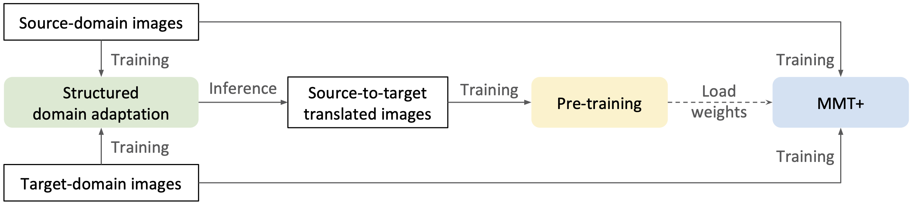
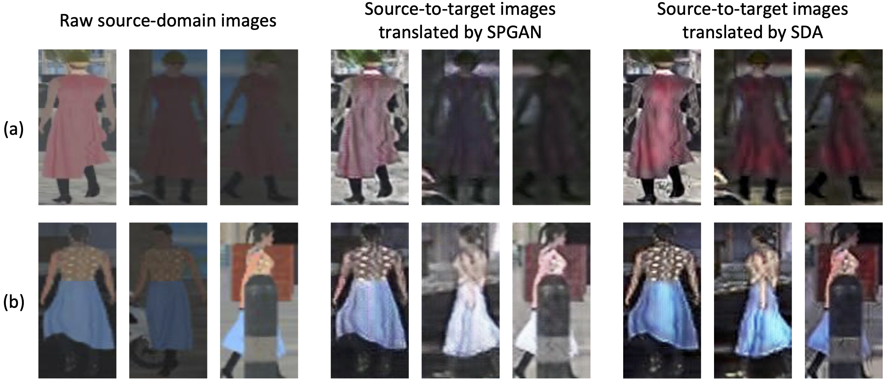

## Solution for VisDA 2020 [[Technique Report]](files/visda.pdf)

### Requirements

+ Python 3
+ PyTorch >= 1.1

### Installation

+ Install `visda` library
```shell
python setup.py develop
```
+ Install `NVIDIA/apex` library (**optional**, for mixed precision training)
```shell
git clone https://github.com/NVIDIA/apex.git
cd apex
python setup.py install --cuda_ext --cpp_ext
```
Active it by adding `--fp16` in the training commands.

### Prepare Datasets
```
examples
├── data
│   ├── index_validation_gallery.txt  
│   ├── index_validation_query.txt  
│   ├── index_test_gallery.txt  
│   ├── index_test_query.txt     
│   ├── personX
│   ├── personX_sda
│   ├── target_training
│   ├── target_test
└── └── target_validation
```

### Testing

The trained models for our submission can be downloaded from:
+ Re-ID model:
  + ResNeSt-50 [[Google Drive]](https://drive.google.com/file/d/1Wd0SZB_K896rrcmBTOKtvN8U_GlgCfLc/view?usp=sharing)
  + ResNeSt-101 [[Google Drive]](https://drive.google.com/file/d/1U99XtSUxejH_RjdbNShKQKQ4SvleROJA/view?usp=sharing)
  + DenseNet-169-IBN [[Google Drive]](https://drive.google.com/file/d/1oOzYsGzqIC4m9u_dOw4UOJ4d-wlZ9zTA/view?usp=sharing)
  + ResNeXt-101-IBN [[Google Drive]](https://drive.google.com/file/d/1SvflLaRifGtl5hh5kw6ZsVIABjxdEp-w/view?usp=sharing)
+ Camera model:
  + ResNeSt-50 [[Google Drive]](https://drive.google.com/file/d/1qd8ybMtLWXRQOasQzHLh6ZWFLOvwv4Pe/view?usp=sharing)

#### Test a single model
```shell
./scripts/test.sh $ARCH $PATH $PARTITION
```
#### Model ensembling and testing
```shell
./scripts/test_ensemble.sh $PARTITION
```

| Team Name | mAP(%) | top-1(%) |
| ----- | :------: | :---------: |
| Logwhen | 79.05 | 83.26 |
| Vimar Team | 76.56 | 84.25 |
| **Ours** | **74.78** | **82.86** |
| Xiangyu | 72.39 | 83.85 |
| Archer2 | 70.39 | 79.70 |

### Training

<p align="center">
    
</p>

#### Stage I: Structured Domain Adaptation (SDA)

You could directly download the generated images from [[Google Drive]](https://drive.google.com/file/d/1gX_A2AknZp8GtQqgtW2UVwcSCmhFhOgN/view?usp=sharing), or you could use the following scripts to train your own SDA model.

<p align="center">
    
</p>

+ Train SDA:
```shell
./scripts/train_sda.sh $PARTITION
```
+ Generate source-to-target images:
```shell
./scripts/test_sda.sh $PATH $PARTITION
```

#### Stage II: Pre-training

```shell
./scripts/pretrain.sh $ARCH 1 $PARTITION
./scripts/pretrain.sh $ARCH 2 $PARTITION
```

#### Stage III: Improved Mutual Mean-Teaching (MMT+)

<p align="center">
    
</p>

```shell
./scripts/train_mmt_dbscan.sh $ARCH $PARTITION
```
